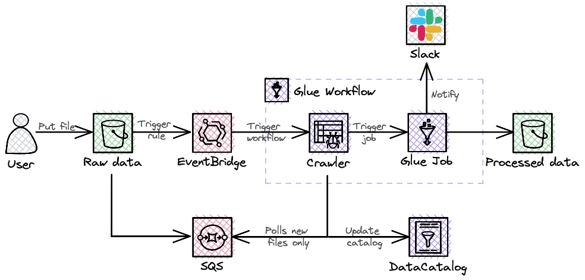

# Serverless data transformation pipeline

**Table of Contents**

- [Serverless data transformation pipeline](#serverless-data-transformation-pipeline)
  - [Data pipeline requirements](#data-pipeline-requirements)
    - [Problem Context](#problem-context)
    - [Constraints](#constraints)
    - [Functional requirements](#functional-requirements)
    - [Non-functional requirements](#non-functional-requirements)
  - [Proposed solution](#proposed-solution)
    - [Architecture diagram](#architecture-diagram)
    - [Cost breakdown](#cost-breakdown)
    - [Deployment](#deployment)
  - [Useful commands](#useful-commands)

## Data pipeline requirements

### Problem Context

Data providers upload raw data into S3  bucket.

This data will be extracted, transformed and loaded into ...

### Constraints

- AWS is the preferred cloud provider
- Development team has limited capacity, so the solution should require minimal development and maintenance effort

### Functional requirements

- **FR-1** Application should save table schema
- **FR-2** Application should be triggered by file upload event
- **FR-3** Application should perform data quality checks and transformations
- **FR-4** Data should be stored in query-optimised format
- **FR-5** Application should notify users if data checks fail via corporate messenger

### Non-functional requirements
- **NFR-1** Due to massive file size processing can take up to 20 minutes
- **NFR-2** Solution should be cost effective

## Proposed solution

> 💡 *Everything in software architecture is a trade-off. First Law of Software Architecture*


### Architecture diagram



---

All resources will be deployed as a Stack to allow centralised creation, modification and deletion of resources in any account. The process will be monitored by CloudWatch and all errors will be sent to Slack channel.

To trigger the process by raw file upload event, (1) enable S3 Events Notifications to send event data to SQS queue and (2) create EventBridge Rule to send event data and trigger Glue Workflow. Both event handlers are needed because they have different ranges of targets and different event JSON structures.

Once the new raw file is uploaded, Glue Workflow starts:

- The first component of Glue Workflow is Glue Crawler. It polls SQS queue to get information on newly uploaded files and crawls only them instead of a full bucket scan. If the file is corrupted, then process will stop and error event will be generated.

- The second component of Glue Workflow is Glue Job. It completes the business logic (data transformation and end user notification) and saves the processed data to another S3 bucket.

### Cost breakdown

| Service | Configuration | Monthly cost |
| --- | --- | --- |
| Glue Job | 1 DPU, running time 600 minutes | $4.40 |
| Amazon S3 | S3 standard (100 GB), S3 Glacier Flexible Retrieval (100 GB) | $2.88 |
| Glue Crawler | Running time 300 minutes | $2.20 |
| AWS CloudFormation | Third-party extension operations (0) | $0.00 |
| Amazon SQS | Requests per month 600 | $0.00 |
|TOTAL COST |  | $9.48 |

### Deployment

All infrastructure components are prepared using IaC tool - AWS CDK.

[CDK assets](cdk-assets/) 

The `cdk.json` file tells the CDK Toolkit how to execute your app.

This project is set up like a standard Python project.  The initialization
process also creates a virtualenv within this project, stored under the `.venv`
directory.  To create the virtualenv it assumes that there is a `python3`
(or `python` for Windows) executable in your path with access to the `venv`
package. If for any reason the automatic creation of the virtualenv fails,
you can create the virtualenv manually.

To manually create a virtualenv on MacOS and Linux:

```
$ python3 -m venv .venv
```

After the init process completes and the virtualenv is created, you can use the following
step to activate your virtualenv.

```
$ source .venv/bin/activate
```

If you are a Windows platform, you would activate the virtualenv like this:

```
% .venv\Scripts\activate.bat
```

Once the virtualenv is activated, you can install the required dependencies.

```
$ pip install -r requirements.txt
```

At this point you can now synthesize the CloudFormation template for this code.

```
$ cdk synth
```

## Useful commands

 * `cdk ls`          list all stacks in the app
 * `cdk synth`       emits the synthesized CloudFormation template
 * `cdk deploy`      deploy this stack to your default AWS account/region
 * `cdk diff`        compare deployed stack with current state
 * `cdk docs`        open CDK documentation

Enjoy!
